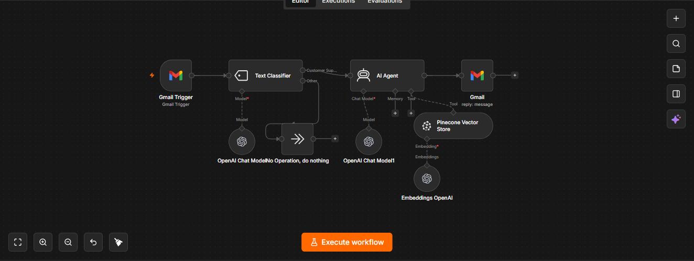

# AI Customer Support Email Responder

An n8n workflow that automatically handles incoming customer-support emails, checks whether an email is actually a support request, uses an AI agent to prepare a response, retrieves relevant information from a knowledge base, and replies to the customer.

The goal is to reduce repetitive support work while keeping responses grounded in the store's policies and FAQ information.



---

## What it does

The workflow follows this process:

```text
Incoming Gmail message
        ↓
Classify the email
        ↓
Customer Support?
     ↙        ↘
   Yes         No
    ↓           ↓
 AI Agent     Stop
    ↓
Retrieve information
from knowledge base
    ↓
Generate response
    ↓
Reply to customer
```

### 1. Monitor Gmail

The workflow starts with a Gmail trigger that checks for incoming emails. The current workflow is configured to poll for new messages every minute.

### 2. Classify the email

An AI text classifier determines whether the incoming message is:

- **Customer Support**
- **Other**

This prevents unrelated emails from being sent through the customer-support response process.

The classifier is instructed to treat questions about products, services, orders, shipping, returns, refunds, complaints, technical issues, policies, and FAQs as customer-support messages.

### 3. Process support requests with an AI agent

When an email is classified as customer support, it is passed to an AI agent.

The agent receives the original email and is instructed to respond as a customer-support representative.

### 4. Retrieve information from the knowledge base

The AI agent has access to a Pinecone vector store as a knowledge-base tool.

The vector store contains the information the agent can use to answer questions about policies and FAQs.

This gives the agent a source of information to consult instead of relying only on the language model's general knowledge.

### 5. Generate the response

The AI agent uses the incoming email together with information retrieved from the knowledge base to generate the response.

### 6. Reply through Gmail

Finally, the generated response is sent as a reply to the original Gmail message.

---

## Workflow architecture

The main components are:

- **Gmail Trigger** — receives incoming emails
- **Text Classifier** — determines whether the email requires customer support
- **OpenAI Chat Model** — powers the AI processing
- **AI Agent** — generates the customer-support response
- **Pinecone Vector Store** — provides FAQ and policy information
- **OpenAI Embeddings** — connects the AI system to the vector store
- **Gmail** — sends the final response

---

## Why use a classifier first?

Not every incoming email needs an AI-generated customer-support response.

The classifier creates a decision point before the more expensive processing happens:

```text
Incoming email
      ↓
Is it customer support?
   ↙           ↘
 Yes            No
  ↓              ↓
AI response     Stop
```

This makes the automation more controlled and avoids processing unrelated messages unnecessarily.

---

## Why use a vector database?

A customer-support agent should not invent company policies or FAQ answers.

Using a vector database allows the workflow to retrieve relevant information from a dedicated knowledge base and provide that information to the AI agent when generating a response.

In this workflow, Pinecone is used as the retrieval layer.

---

## Technologies

- **n8n** — workflow automation
- **Gmail** — email trigger and replies
- **OpenAI** — language model and embeddings
- **Pinecone** — vector database / knowledge base

---

## Requirements

Before importing the workflow, you will need:

- An n8n instance
- A Gmail account that can be connected to n8n
- An OpenAI API connection
- A Pinecone account and index
- A knowledge base containing your own FAQ and policy information

---

## Importing the workflow

1. Download `workflow.json`.
2. Open your n8n instance.
3. Import the JSON workflow.
4. Connect your own Gmail credentials.
5. Connect your own OpenAI credentials.
6. Connect your own Pinecone credentials.
7. Configure your Pinecone index and namespace.
8. Make sure your knowledge base contains the FAQ and policy information you want the AI agent to use.
9. Send a test customer-support email and check the generated reply.

---

## Configuration

The public workflow is a sanitized copy.

It does **not** contain my private API keys, OAuth credentials, account-specific credential IDs, or n8n instance information.

You will need to connect your own credentials after importing the workflow.

You may also want to change:

- The customer-support classification rules
- The AI agent's system prompt
- The knowledge-base content
- The Pinecone index and namespace
- The email account
- The tone and format of generated responses

The workflow is intended as a reusable starting point rather than a plug-and-play service tied to one specific business.

---

## Example

A customer might send an email asking:

```text
What is your return policy?
```

The workflow can:

1. Receive the email through Gmail.
2. Classify it as customer support.
3. Pass it to the AI agent.
4. Search the knowledge base for the relevant return-policy information.
5. Generate a response using that information.
6. Reply to the original email.

The same structure can be adapted for questions about shipping, refunds, orders, product information, and other common support topics.

---

## Repository structure

```text
ai-customer-support-email-responder/
│
├── README.md
├── workflow.json
└── screenshots/
    └── workflow.png
```

---

## Important note

This workflow is designed for demonstration and learning purposes.

Before using it for real customer communication, test the responses carefully and make sure the knowledge base contains accurate and up-to-date information.

AI-generated responses should not be treated as automatically correct simply because they were retrieved from a knowledge-base workflow. The quality of the final response depends on the quality of the information stored in the knowledge base and the instructions given to the AI agent.

---

## License

This project is released under the MIT License.
